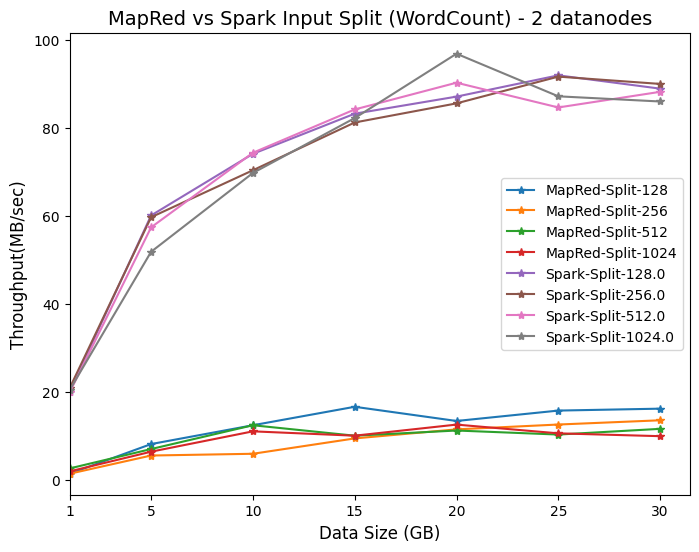

# PERFORMANCE ANALYSIS OF APACHE HADOOP AND APACHE SPARK ON BIG DATA

## Team Members

| **ID** | **Full Name** |
|:------:|:-------------:|
| **21280099** | Nguyen Cong Hoai Nam |
| **21280118** | Le Nguyen Hoang Uyen |
| **21280124** | Huynh Nguyen The Dan |

## Summary

This research aims to build a distributed data processing system architecture using two core platforms: MapReduce (Hadoop) and Spark. The goal is to evaluate their capabilities in handling large-scale data processing. Both Hadoop and Spark have more than 150 configurable parameters that significantly impact system performance. This study addresses the following key questions:

1. Does increasing the number of datanodes improve data processing speed?
2. How do system parameters specifically affect performance?
3. How does the performance of MapReduce compare to Spark for specific problems?

### System Architecture

The detailed configuration of the experimental setup is as follows:

| **Component**       | **Specifications**               |
|---------------------|----------------------------------|
| Masternode          | CPU: Intel i7-1065G7 (8) @ 3.900GHz OS: Ubuntu 24.04 LTS x86_64 RAM: 12GB Storage: 512GB SSD |
| Datanode (1 or 2)   | CPU: Intel i7-1065G7 (8) @ 3.900GHz OS: Ubuntu Server 24.04.1 RAM: 2560MB Storage: 100GB CPU Cores: 2 |
| Software            | JDK: 8 Hadoop: 3.2 Spark: 3.0 |
| Workload            | WordCount and TeraSort problems |

Detailed deployment guide: [Here](https://puffy-volleyball-97c.notion.site/Performance-Analysis-Between-Hadoop-and-Spark-using-HiBench-11fc4840c17c803db3caf41647b0e0de)

### Results
This is the overall result to see details go: [report.pdf](Report.pdf)
#### MapReduce vs. Spark Comparison

| **WordCount** | **MapReduce** | **Spark** | **Speedup (MapReduce/Spark)** |
|---------------|---------------|-----------|--------------------------------|
| 1GB           | 728s          | 52s       | 14                              |
| 5GB           | 628s          | 87s       | 7                               |
| 10GB          | 824s          | 141s      | 6                               |
| 15GB          | 924s          | 188s      | 5                               |
| 20GB          | 1528s         | 239s      | 6                               |
| 25GB          | 1624s         | 283s      | 6                               |
| 30GB          | 1896s         | 352s      | 5                               |

| **TeraSort** | **MapReduce** | **Spark** | **Speedup (MapReduce/Spark)** |
|-------------|---------------|-----------|--------------------------------|
| 1GB         | 174s          | 71s       | 2                               |
| 5GB         | 498s          | 202s      | 2                               |
| 10GB        | 624s          | 347s      | 2                               |
| 15GB        | 928s          | 488s      | 2                               |
| 20GB        | 1728s         | 622s      | 3                               |
| 25GB        | 2539s         | 759s      | 3                               |
| 30GB        | 2839s         | 813s      | 3                               |

#### Execution Time Charts

  
  

The above charts compare the execution times of Spark and MapReduce for the WordCount and TeraSort problems under different input split configurations.

- For the **WordCount** problem, Spark demonstrates superior performance over MapReduce, achieving an average speedup of 6x and up to 14x in the best-case scenario.
- For the **TeraSort** problem, Spark processes data 2-3 times faster than MapReduce depending on the input size.

#### Throughput Charts

  
  

Throughput is measured as the amount of data processed per unit time (MB/s). The results show:

- For **WordCount**, Spark's throughput is 5 to 14 times higher than MapReduce.
- For **TeraSort**, Spark's throughput is 2 to 3 times higher than MapReduce.

Overall, Spark's performance tends to be linear and scales well with increasing data sizes. In contrast, MapReduce's performance is non-linear and converges to a constant value as the input data size increases.
